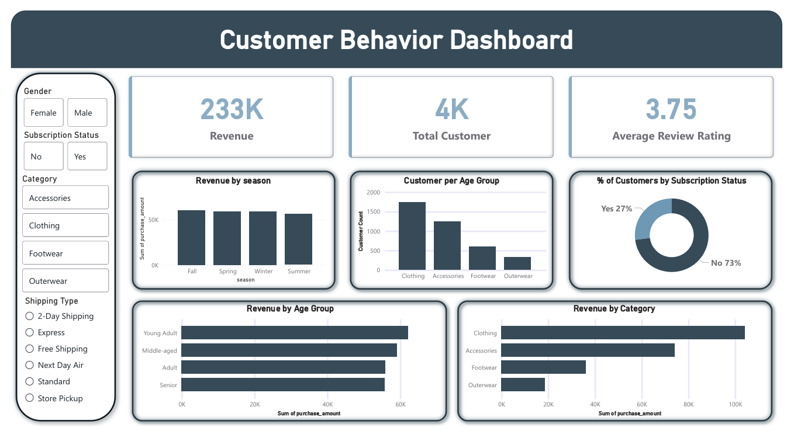

# Customer Behavior Analysis Project

## Project Overview

This project provides a comprehensive analysis of customer shopping behavior using SQL-based data analytics. The analysis examines various dimensions of customer purchasing patterns, including temporal trends, product preferences, payment methods, demographic influences, and seasonal variations. By leveraging structured query language (SQL) to extract meaningful insights from transactional data, this project aims to support data-driven decision-making in retail and e-commerce domains.

The primary objectives are to:
- Identify key patterns and trends in customer purchasing behavior
- Analyze revenue distribution across different segments
- Understand demographic and seasonal influences on shopping patterns
- Provide actionable insights for business strategy optimization
- Support inventory management and marketing effectiveness

## Data Summary

The analysis is based on a comprehensive customer shopping dataset containing the following attributes:

### Dataset Attributes

- **Customer Demographics**
  - Age: Customer age
  - Gender: Male/Female classification
  
- **Transaction Details**
  - Invoice No: Unique transaction identifier
  - Invoice Date: Date of purchase
  - Purchase Amount (USD): Transaction value
  
- **Product Information**
  - Category: Product category classification
  - Item Purchased: Specific item name
  - Quantity: Number of items purchased
  
- **Shopping Context**
  - Shopping Mall: Location of purchase
  - Payment Method: Payment type used
  - Season: Seasonal classification (Spring, Summer, Fall, Winter)
  - Subscription Status: Customer subscription indicator

The dataset enables multi-dimensional analysis across customer segments, product categories, temporal patterns, and geographic locations.

## SQL Queries and Objectives

The following table presents all SQL queries implemented in this project along with their specific analytical objectives:

| Query # | SQL Query | Objective |
|---------|-----------|----------|
| 1 | `SELECT * FROM customer LIMIT 5;` | Preview the dataset structure and first 5 records to understand data schema |
| 2 | `SELECT category, AVG(purchase_amount__usd_) AS avg_purchase FROM customer GROUP BY category ORDER BY avg_purchase DESC;` | Calculate average purchase amount per product category to identify high-value categories |
| 3 | `SELECT season, COUNT(*) AS customer_count FROM customer GROUP BY season ORDER BY customer_count DESC;` | Analyze customer purchase frequency across different seasons to identify peak shopping periods |
| 4 | `SELECT payment_method, COUNT(*) AS count FROM customer GROUP BY payment_method ORDER BY count DESC LIMIT 1;` | Identify the most commonly used payment method to optimize payment processing |
| 5 | `SELECT shopping_mall, SUM(purchase_amount__usd_) AS total_purchase FROM customer GROUP BY shopping_mall ORDER BY total_purchase DESC LIMIT 5;` | Determine top 5 shopping mall locations by total revenue to assess location performance |
| 6 | `SELECT gender, SUM(purchase_amount__usd_) AS total_revenue FROM customer GROUP BY gender;` | Compare total revenue generated by male and female customers for demographic insights |
| 7 | `SELECT CASE WHEN age BETWEEN 18 AND 25 THEN '18-25' WHEN age BETWEEN 26 AND 35 THEN '26-35' WHEN age BETWEEN 36 AND 45 THEN '36-45' WHEN age BETWEEN 46 AND 55 THEN '46-55' ELSE '56+' END AS age_group, SUM(purchase_amount__usd_) AS total_revenue FROM customer GROUP BY age_group ORDER BY total_revenue DESC;` | Segment customers into age groups and analyze revenue contribution by each segment |
| 8 | `SELECT subscription_status, COUNT(*) AS customer_count, AVG(purchase_amount__usd_) AS avg_purchase FROM customer GROUP BY subscription_status;` | Compare purchase behavior between subscribed and non-subscribed customers |

## Methodology

### 1. Data Preparation and Import
- Import customer shopping dataset into SQL database
- Validate data integrity and completeness
- Examine data types and schema structure
- Identify and handle any missing or anomalous values
- Ensure proper indexing for query optimization

### 2. Exploratory Data Analysis (EDA)
- Conduct initial preview of dataset using SELECT queries
- Examine statistical distributions of key variables
- Identify data ranges, outliers, and patterns
- Understand relationships between different attributes
- Document data characteristics and limitations

### 3. SQL Query Development and Execution

#### Aggregation Techniques
- Utilize **SUM()** for total revenue calculations
- Apply **AVG()** for average purchase amount analysis
- Implement **COUNT()** for frequency analysis
- Use **GROUP BY** for categorical segmentation

#### Filtering and Sorting
- Apply **WHERE** clauses for conditional filtering
- Implement **ORDER BY** for result ranking
- Use **LIMIT** for top-N analysis

#### Advanced Analytics
- Employ **CASE** statements for customer segmentation
- Create age group classifications dynamically
- Implement conditional logic for business rules

### 4. Analysis and Interpretation
- Execute queries systematically to address analytical objectives
- Extract and document query results
- Interpret findings in business context
- Identify actionable patterns and trends
- Cross-validate results across different dimensions

### 5. Insights Generation
- Synthesize findings from multiple queries
- Identify key performance indicators (KPIs)
- Develop business recommendations
- Document limitations and assumptions
- Propose areas for further investigation

## Key Findings

Based on the SQL analysis, the following insights were derived:

### Revenue Analysis
- **Product Categories**: Certain categories demonstrate significantly higher average purchase amounts, indicating premium product segments
- **Location Performance**: Top 5 shopping malls account for a substantial portion of total revenue, suggesting geographic concentration
- **Customer Value**: Clear differentiation exists between high-value and regular customer segments

### Demographic Insights
- **Gender Patterns**: Analysis reveals spending behavior differences between male and female customers
- **Age Segmentation**: Different age groups exhibit distinct purchasing patterns and revenue contributions
- **Subscription Impact**: Subscribed customers show different purchase behaviors compared to non-subscribers

### Temporal and Seasonal Trends
- **Seasonal Variations**: Customer purchase frequency varies significantly across seasons
- **Peak Periods**: Certain seasons demonstrate higher customer engagement and transaction volumes

### Payment Preferences
- **Dominant Methods**: Clear preference exists for specific payment methods among customers
- **Transaction Patterns**: Payment method choice correlates with transaction characteristics

## Power BI Dashboard

This project includes an interactive Power BI dashboard that visualizes the key findings from the SQL analysis. The dashboard provides dynamic insights into customer behavior patterns, revenue trends, and demographic segmentation.

### Dashboard Features

The Power BI dashboard includes the following visualizations:

- **Revenue Overview**: Total revenue metrics and trends over time
- **Category Performance**: Visual breakdown of purchase amounts by product category
- **Demographic Analysis**: Customer segmentation by age groups and gender
- **Seasonal Trends**: Purchase patterns across different seasons
- **Location Insights**: Shopping mall performance comparison
- **Payment Method Distribution**: Visualization of payment preferences
- **Customer Segmentation**: Subscription status analysis and customer value tiers

### Dashboard Screenshot

> **Note**: Add your Power BI dashboard screenshot below

<!-- 
To add your Power BI dashboard screenshot:
1. Take a screenshot of your complete Power BI dashboard
2. Save the image file (recommended name: powerbi_dashboard.png)
3. Upload the image to this repository (you can drag and drop it into the GitHub file editor)
4. Replace the placeholder below with your image:
   
-->

**[Dashboard Screenshot Placeholder]**



### Dashboard Insights Summary

The Power BI dashboard transforms the SQL query results into actionable visual insights, enabling stakeholders to:
- Quickly identify top-performing categories and locations
- Track revenue trends and seasonal patterns at a glance
- Explore customer segments interactively with filters and drill-downs
- Make data-driven decisions based on visual analytics
- Export insights for presentations and reports

## Conclusion

This customer behavior analysis project successfully demonstrates the application of SQL-based analytics to extract meaningful insights from transactional data. Through systematic query development and execution, the project has achieved the following:

### Analytical Achievements
1. **Comprehensive Data Examination**: Successfully analyzed customer shopping behavior across multiple dimensions including demographics, product categories, locations, and temporal patterns
2. **Revenue Intelligence**: Identified key revenue drivers including high-performing categories, locations, and customer segments
3. **Customer Segmentation**: Established clear customer segments based on age, gender, subscription status, and purchasing patterns
4. **Seasonal Insights**: Uncovered seasonal variations in customer shopping behavior to inform inventory and marketing strategies
5. **Visual Analytics**: Developed interactive Power BI dashboard for dynamic exploration of insights

### Business Value

The insights generated through this analysis provide substantial value for:

- **Strategic Planning**: Data-driven foundation for long-term business strategy development
- **Marketing Optimization**: Targeted approach for customer segment-specific campaigns
- **Inventory Management**: Category and seasonal insights for optimized stock planning
- **Location Strategy**: Performance metrics for site selection and resource allocation
- **Customer Experience**: Understanding of preferences to enhance service delivery
- **Revenue Growth**: Identification of high-value segments and cross-selling opportunities

### Practical Applications

Retail and e-commerce organizations can leverage these findings to:
- Optimize product mix based on category performance
- Allocate marketing budgets efficiently across customer segments
- Plan seasonal promotions aligned with customer behavior patterns
- Enhance payment processing infrastructure based on customer preferences
- Develop loyalty programs tailored to different demographic groups
- Make informed decisions about store locations and expansions

### Technical Proficiency

This project demonstrates proficiency in:
- SQL query writing and optimization
- Aggregate functions and grouping operations
- Conditional logic and case statements
- Data segmentation and classification
- Result interpretation and business intelligence
- Data visualization using Power BI

The structured approach to SQL analytics employed in this project serves as a replicable framework for similar business intelligence initiatives, ultimately contributing to improved customer satisfaction, operational efficiency, and business profitability.

## Technologies Used

- **SQL**: Primary language for data querying and analysis
- **Database Management System**: For data storage and query execution
- **Jupyter Notebook**: Interactive environment for documentation and code execution
- **Python**: For data manipulation and SQL integration (pandas, sqlite3)
- **Power BI**: Interactive dashboard creation and data visualization

## Repository Structure

```
customer_behavior_analysis/
│
├── customer_shopping_behaviour.ipynb    # Main analysis notebook
├── customer_shopping_behavior_sql_queries.sql    # SQL queries file
├── powerbi_dashboard.png    # Dashboard screenshot (to be added)
└── README.md    # Project documentation
```


## Author

**AnandMukherjee2004**

## Repository

[Customer Behavior Analysis](https://github.com/AnandMukherjee2004/customer_behavior_analysis)

---

*This project demonstrates practical application of SQL analytics and business intelligence visualization for data-driven decision-making in retail operations.*
